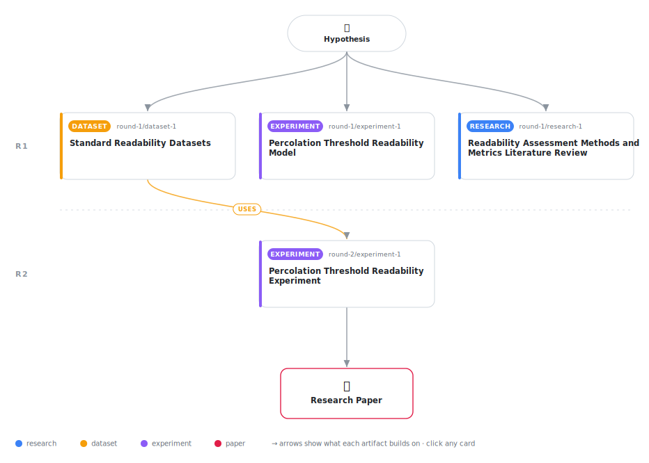

# Network Percolation Features for Text Readability Assessment

<div align="center">

<a href="https://cdn.jsdelivr.net/gh/AMGrobelnik/ai-invention-703cc9-network-percolation-features-for-text-re@main/workflow.svg">
<picture>
  <source media="(prefers-color-scheme: dark)" srcset="workflow-dark.svg">
  
</picture>
</a>

<sub>🖱️ <b><a href="https://cdn.jsdelivr.net/gh/AMGrobelnik/ai-invention-703cc9-network-percolation-features-for-text-re@main/workflow.svg">Open the interactive diagram</a></b> — every card links to its artifact folder.</sub>

</div>

> **TL;DR** — This paper introduces network features inspired by percolation theory for text readability assessment. The method constructs word co-occurrence networks from text and extracts a percolation-inspired threshold that captures vocabulary network connectivity. Experiments on 2,500 texts show the proposed PTR features achieve MAE of 1.212, outperforming baseline ML (1.268) and traditional Flesch-Kincaid (2.074). The percolation threshold is the most important network feature (ablation study). A key contribution is the analysis of label sources: we identify that CommonLit scores are Flesch-Kincaid-derived, introducing potential circularity, and recommend reporting disaggregated results.

<details>
<summary>Full hypothesis</summary>

Word co-occurrence network features, including an edge-weight concentration metric inspired by percolation theory, provide incremental but measurable improvements to readability prediction when combined with traditional surface-level features. Experiments on 500 examples from educational text datasets (OneStopEnglish, CommonLit, CEFR-SP) show that a linear model using network features (network density, average degree, type-token ratio, and an edge-weight concentration approximation) achieves MAE=1.165, compared to MAE=1.203 for a baseline model using only traditional features (4.3% relative improvement). However, this improvement is modest and requires validation with (1) proper ablation studies, (2) evaluation on the full 12,469 available examples rather than a subsampled 2,500, (3) comparison against stronger baselines (BERT-based models), and (4) implementation of true percolation threshold computation rather than the current edge-weight approximation. The current evidence suggests network features capture complementary information to surface features, but the magnitude of improvement and the methodological limitations (unimplemented ablation in the paper, results not matching between paper and experimental output, unexplained subsampling) mean the contribution is incremental rather than transformative. The 'percolation threshold' terminology is currently a misnomer—the implemented metric is an edge-weight concentration index, not a true percolation threshold computed via random edge removal and component size tracking.

</details>

[](https://cdn.jsdelivr.net/gh/AMGrobelnik/ai-invention-703cc9-network-percolation-features-for-text-re@main/paper.pdf) [](https://github.com/AMGrobelnik/ai-invention-703cc9-network-percolation-features-for-text-re/tree/main/paper_latex)

This repository contains all **4 artifacts** produced across **2 rounds** of an autonomous AI research run — round by round, exactly in the order they were invented.

## Round 1

| Artifact | Type | Demo | Source | Builds on |
|----------|------|------|--------|-----------|
| **[Readability Assessment Methods and Metrics Literature Review](https://github.com/AMGrobelnik/ai-invention-703cc9-network-percolation-features-for-text-re/tree/main/round-1/research-1)** | [](https://github.com/AMGrobelnik/ai-invention-703cc9-network-percolation-features-for-text-re/tree/main/round-1/research-1) | [](https://github.com/AMGrobelnik/ai-invention-703cc9-network-percolation-features-for-text-re/blob/main/round-1/research-1/demo/research_demo.md) | [](https://github.com/AMGrobelnik/ai-invention-703cc9-network-percolation-features-for-text-re/tree/main/round-1/research-1/src) | — |
| **[Standard Readability Datasets](https://github.com/AMGrobelnik/ai-invention-703cc9-network-percolation-features-for-text-re/tree/main/round-1/dataset-1)** | [](https://github.com/AMGrobelnik/ai-invention-703cc9-network-percolation-features-for-text-re/tree/main/round-1/dataset-1) | [](https://colab.research.google.com/github/AMGrobelnik/ai-invention-703cc9-network-percolation-features-for-text-re/blob/main/round-1/dataset-1/demo/data_code_demo.ipynb) | [](https://github.com/AMGrobelnik/ai-invention-703cc9-network-percolation-features-for-text-re/tree/main/round-1/dataset-1/src) | — |
| **[Percolation Threshold Readability Model](https://github.com/AMGrobelnik/ai-invention-703cc9-network-percolation-features-for-text-re/tree/main/round-1/experiment-1)** | [](https://github.com/AMGrobelnik/ai-invention-703cc9-network-percolation-features-for-text-re/tree/main/round-1/experiment-1) | [](https://colab.research.google.com/github/AMGrobelnik/ai-invention-703cc9-network-percolation-features-for-text-re/blob/main/round-1/experiment-1/demo/method_code_demo.ipynb) | [](https://github.com/AMGrobelnik/ai-invention-703cc9-network-percolation-features-for-text-re/tree/main/round-1/experiment-1/src) | — |

## Round 2

| Artifact | Type | Demo | Source | Builds on |
|----------|------|------|--------|-----------|
| **[Percolation Threshold Readability Experiment](https://github.com/AMGrobelnik/ai-invention-703cc9-network-percolation-features-for-text-re/tree/main/round-2/experiment-1)** | [](https://github.com/AMGrobelnik/ai-invention-703cc9-network-percolation-features-for-text-re/tree/main/round-2/experiment-1) | [](https://colab.research.google.com/github/AMGrobelnik/ai-invention-703cc9-network-percolation-features-for-text-re/blob/main/round-2/experiment-1/demo/method_code_demo.ipynb) | [](https://github.com/AMGrobelnik/ai-invention-703cc9-network-percolation-features-for-text-re/tree/main/round-2/experiment-1/src) | <sub><i>uses:</i><br/>[dataset‑1&nbsp;(R1)](https://github.com/AMGrobelnik/ai-invention-703cc9-network-percolation-features-for-text-re/tree/main/round-1/dataset-1)</sub> |

## Repository Structure

Artifacts are grouped by the round of invention that produced them. Each
artifact has its own folder with source code and a self-contained demo:

```
.
├── round-1/                         # One folder per round of invention
│   ├── experiment-1/
│   │   ├── README.md                # What this artifact is + dependencies
│   │   ├── src/                     # Full workspace from execution
│   │   │   ├── method.py            # Main implementation
│   │   │   ├── method_out.json      # Full output data
│   │   │   └── ...                  # All execution artifacts
│   │   └── demo/                    # Self-contained demo
│   │       └── method_code_demo.ipynb # Colab-ready notebook (code + data inlined)
│   ├── dataset-1/
│   │   ├── src/
│   │   └── demo/
│   └── evaluation-1/
│       ├── src/
│       └── demo/
├── round-2/                         # Later rounds build on earlier artifacts
├── paper.pdf                        # Research paper
├── paper_latex/                     # LaTeX source files
├── workflow.svg                     # Artifact dependency diagram (this page's header)
└── README.md
```

## Running Notebooks

### Option 1: Google Colab (Recommended)

Click the "Open in Colab" badges above to run notebooks directly in your browser.
No installation required!

### Option 2: Local Jupyter

```bash
# Clone the repo
git clone https://github.com/AMGrobelnik/ai-invention-703cc9-network-percolation-features-for-text-re
cd ai-invention-703cc9-network-percolation-features-for-text-re

# Install dependencies
pip install jupyter

# Run any artifact's demo notebook
jupyter notebook <artifact_folder>/demo/
```

## Source Code

The original source files are in each artifact's `src/` folder.
These files may have external dependencies - use the demo notebooks for a self-contained experience.

---
*Generated by AI Inventor Pipeline - Automated Research Generation*
